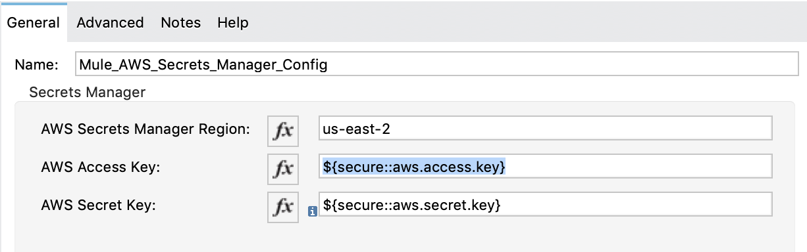

# AWS Secrets Manager for Properties Override for Mule 4

This module will be used to override properties during deployment. This will work in tandem with
- properties placeholder
- secure properties placeholder

## Deploying to Exchange
Clone the project to your local, change the groupId to point your orgId. Issue `mvn deploy`.
Ensure that there is an entry in your settings.xml pertaining to Exchange2

## Local Install
For local install, give any groupId. Issue `mvn clean install`

## Using the module in a Mule4 Project
Add this dependency to your application pom.xml

```
<dependency>
	<groupId>${groupId}</groupId>
	<artifactId>mule-aws-secrets-manager-properties-providers-module</artifactId>
	<version>${version}</version>
	<classifier>mule-plugin</classifier>
</dependency>
```

## Configuration

### Region
Regions are to be provided in plain text.

### Access and Secret Keys
These should be provided as part of the wrapper.conf or during deployment.
These can be provided through secure properties also.

### Secret Name
The secret name should be provided against which Mule will fetch keys from 
AWS Secrets Manager.

### Version Stage
- For all purposes the version has been set to **AWSCURRENT** directly in the code.
- The code can be changed to allow a user-based entry for this.

### Example Config
A sample config.
```
<mule-aws-secrets-manager:config name="Mule_AWS_Secrets_Manager_Config"
		doc:name="Mule AWS Secrets Manager Config" doc:id="fd890b83-8a34-45ea-81c6-92a9c9f35ede">
		<mule-aws-secrets-manager:secrets-manager
			region="us-east-2" accessKey="${aws.access.key}" secretKey="${aws.secret.key}"
			secretName="${secret.name}" />
	</mule-aws-secrets-manager:config>
```



## Usage

### Prefix
- For all purposes, this module relies on **aws-secrets** as the prefix.
- Any property provided as **${aws-secrets::}** will be referenced from AWS Secrets Manager.

### Secret Name and Key
- There can be `n` number of secrets in AWS Secrets Manager. The best way to access a particular key
`${aws-secrets::key}`

### Example Usage

```
<db:config name="Database_Config" 
		doc:name="Database Config"
		doc:id="1cd519a8-9fbe-49c1-9b26-fc79231fe71d">
		<db:my-sql-connection host="127.0.0.1" 
			port="3306"
			user="${aws-secrets::db.username}" 
			password="${aws-secrets::db.password}" 
			database="schema" />
</db:config>
```

## Contributors

Biswa Mohanty, Rahul Dureja, Srinivasan Raghunathan, Sai Parnandi