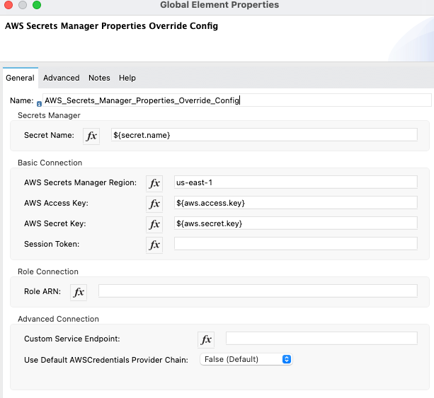
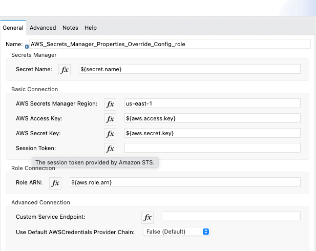
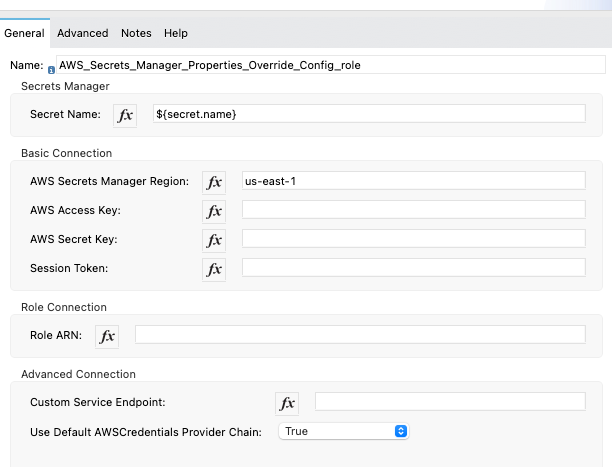

# AWS Secrets Manager for Properties Override for Mule 4

This module allows externalizing application properties using AWS Secrets Manager.
This module retrieves the all secrets (at startup/first use) and caches them for subsequent re-use. 

The module provides following ways to connect to AWS.
They are not mutually exclusive (for example, Default provider chain and Assume Role can be used together)
- Use the default credentials Provider chain. This supports credentials in the following order 
  - Java System Properties (aws.accessKeyId and aws.secretAccessKey)
  - System environment variables (AWS_ACCESS_KEY_ID and AWS_SECRET_ACCESS_KEY)
  - Default Credentials file (normally in the user's home directory, but varies by platform)
  - Amazon ECS environment variable (AWS_CONTAINER_CREDENTIALS_RELATIVE_URI)
  - Instance profile credentials within the instance metadata associated with IAM role for EC2 instances (Preferred for Mule apps running on EC2)
- Basic Connection using AWS Access Key and Secret Key
- Assume IAM Role 

This module will be used to override properties during deployment. This will work in tandem with
- properties placeholder
- secure properties placeholder

## Installation
- Clone the aws-secrets-manager-properties-provider
- Update the GroupId with your organization Id in Pom.xml.
- Ensure that there is an entry in your settings.xml pertaining to Exchange2
- Install to the Local Maven Repository - use mvn clean install
- Installing to Organization's Exchange - use mvn clean deploy

## Using the module in a Mule4 Project
Add this dependency to your application pom.xml

```
<dependency>
	<groupId>${anypoiont.organzationId}</groupId>
	<artifactId>mule-aws-secrets-manager-properties-providers-module</artifactId>
	<version>${version}</version>
	<classifier>mule-plugin</classifier>
</dependency>
```

## Configuration

### Secret Name
The secret name should be provided against which Mule will fetch keys from
AWS Secrets Manager.

### Basic Connection Parameters

#### Region
Regions are to be provided in plain text.

#### Access Key, Secret Key and Session Token
These should be provided as part of the wrapper.conf or during deployment.
These can be provided through secure properties as well. Session Token is optional. 
The user needs to have access to use the Keys used for encrypting secrets

#### Example Config

```
<aws-secrets-manager-properties-override:config
    name="AWS_Secrets_Manager_Properties_Override_Config"
    doc:name="AWS Secrets Manager Properties Override Config"
    doc:id="154e6c95-bc88-4056-b527-41d62046fa2a">
    <aws-secrets-manager-properties-override:secrets-manager
        secretName="${secret.name}" />
    <aws-secrets-manager-properties-override:basic-connection
        region="us-east-1" accessKey="${aws.access.key}"
        secretKey="${aws.secret.key}" />
</aws-secrets-manager-properties-override:config>
```



### Role Connection Parameters
#### Role ARN
Role ARN is required for Assuming an IAM role for Secrets Manager connection.
This role also needs to have access to have access to use the Keys used for encrypting the secrets.

```
<aws-secrets-manager-properties-override:config
    name="AWS_Secrets_Manager_Properties_Override_Config"
    doc:name="AWS Secrets Manager Properties Override Config"
    doc:id="154e6c95-bc88-4056-b527-41d62046fa2a">
    <aws-secrets-manager-properties-override:secrets-manager
        secretName="${secret.name}" />
    <aws-secrets-manager-properties-override:basic-connection
        region="us-east-1" accessKey="${aws.access.key}"
        secretKey="${aws.secret.key}" />
    <aws-secrets-manager-properties-override:role-connection
        roleARN="${aws.role.arn}" />
</aws-secrets-manager-properties-override:config>
```


### Advanced Connection Parameters
#### Custom Service Endpoint
Used to set a VPC endpoint instead of the standard Region endpoint.

#### Use Default AWSCredentials Provider Chain
Set this field to true to obtain credentials from the AWS environment, See: https://docs.aws.amazon.com/sdk-for-java/v2/developer-guide/credentials.html

```
<aws-secrets-manager-properties-override:config
    name="AWS_Secrets_Manager_Properties_Override_Config"
    doc:name="AWS Secrets Manager Properties Override Config"
    doc:id="154e6c95-bc88-4056-b527-41d62046fa2a">
    <aws-secrets-manager-properties-override:secrets-manager
        secretName="${secret.name}" />
    <aws-secrets-manager-properties-override:basic-connection
        region="us-east-1"/>
    <aws-secrets-manager-properties-override:advanced-connection useDefaultAWSCredentialsProviderChain="true" />
</aws-secrets-manager-properties-override:config>
```



### Version Stage
- For all purposes the version has been set to **AWSCURRENT** directly in the code.
- The code can be changed to allow a user-based entry for this.

## Usage

### Prefix
- For all purposes, this module relies on **aws-secrets** as the prefix.
- Any property provided as **${aws-secrets::}** will be referenced from AWS Secrets Manager.

### Secret Name and Key
- There can be `n` number of secrets in AWS Secrets Manager. The best way to access a particular key
`${aws-secrets::key}`

### Caching vs Real-Time
Accessing via "`${aws-secrets::key}`" gives you cached value that is retrieved by a connector when mule app was deployed. Use dataweave ::p expression to get the secrets from aws "real-time". Example is : '#[Mule::p(“aws-secrets::db1-pass”)]'

### Example Usage

```
<db:config name="Database_Config" 
		doc:name="Database Config"
		doc:id="1cd519a8-9fbe-49c1-9b26-fc79231fe71d">
		<db:my-sql-connection host="127.0.0.1" 
			port="3306"
			user="${aws-secrets::db.username}" 
			password="${aws-secrets::db.password}" 
			database="schema" />
</db:config>
```

## Contributors
Biswa Mohanty, Rahul Dureja, Srinivasan Raghunathan, Sai Parnandi, Sudhish Sikhamani, Nabraj Khatri
